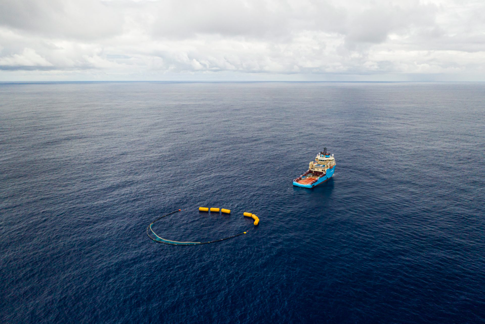

```{r setup, include=FALSE}
knitr::opts_chunk$set(echo = FALSE)
```




## I - SOURCE OF THE ARTICLE WITH PUBLICATION DATE AND WORD COUNT : 

Source of the article: <https://www.globalcitizen.org/en/content/ocean-cleanup-great-pacific-garbage-patch-2/>

Word count: 638

## II - VOCABULARY: See my version of the text with highlighted words 

| Words from the text     | Synonym/explanation in English                                                                              | French translation              |
| ----------------------- | ----------------------------------------------------------------------------------------------------------- | ------------------------------- |
| Tires                   | Rubber around the wheel                                                                                     | Des pneus                       |
| A net                   | Mesh to catch things                                                                                        | Un filet                        |
| A crate                 | A box                                                                                                       | Une caisse                      |
| A recycling facility    | A place for recycling                                                                                       | Un centre de recyclage          |
| A self-contained system | An independent system                                                                                       | Un système autonome             |
| A swath of water        | A band of water = A water area                                                                              | Une bande d'eau, une zone d'eau |
| An eyesore              | A pollution we can sea                                                                                      | Une pollution visuelle          |
| To get entangle         | To tangle                                                                                                   | S'emmêler                       |
| A fishing gear          | A fishing tool                                                                                              | Un engin de pêche               |
| To be wounded           | To be hurted                                                                                                | Être blessé                     |
| To leach                |  To lixiviate = separate (a substance) into soluble and insoluble constituents by the percolation of liquid | Lixivier                        |
| To vow                  | To promise                                                                                                  | Promettre                       |
| To held up              | To hold on                                                                                                  | Tenir bon                       |
| The plastic harvested   | The plastic gathered                                                                                        | Le plastique récolté            |

## III - ANALYSIS TABLE ABOUT THE STUDY: 

|                              |                                                                     |
| ---------------------------- | ------------------------------------------------------------------- |
| Researchers                  | Joe McCarthy and Erica Sanchez     |
| Published in?                |  Global Citizen (10/08/2019)       |
| General topic?               |  The latest Ocean Cleanup prototype is finally working and has been able to retrieve plastic from the sea.                         |
| Procedure/what was examined? |Essay of the operation of the Ocean Cleanup  prototype in the Great Pacific + essay in harsh condition.|
| Conclusions/discovery?       |   __1.__ Success of the first attempt with the Ocean Cleanup prototype + system for recycling plastic. __2.__ Development of a self-contained system in the Great Pacific Garbage Patch. __3.__ Working on prototypes resistant to harsh condition.        --> Ocean Cleanup will be able to expand its efforts.     |
| Remaining questions?         |/|

Link for the pdf of the text with highlighted vocabulary : <https://github.com/AmbreDrm/ambre-dormal-blog/blob/master/pdf/Article%201.pdf>


