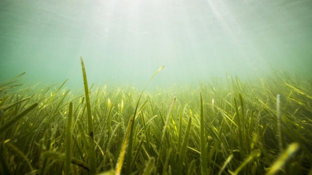

```{r setup, include=FALSE}
knitr::opts_chunk$set(echo = FALSE)
```




## I - SOURCE OF THE ARTICLE WITH PUBLICATION DATE AND WORD COUNT : 

Source of the article: <https://www.bbc.com/news/uk-wales-49567427>

Word count: 387

## II - VOCABULARY: See my version of the text with highlighted words 

| Word from the text | Synonym/definition in English        | French translation                             |
| ------------------ | ------------------------------------ | ---------------------------------------------- |
| Meadows            | Grassland                            | Prairies                                       |
| Wonder plant       | Miracle plant                        | Plante merveilleuse                            |
| Conservationists   | Ecologists                           | Écologistes                                    |
| To address         | To face up                           | Faire face                                     |
| A cod              | A fish                               | Une morue                                      |
| A plaice           | An edible flat fish                  | Une plie (poisson plat)                        |
| A pollock          | A fish                               | Un colin (poisson)                             |
| Whilst             | Whereas                              | Tandis que                                     |
| Livehoods          | Subsistance                          | Moyens d’existence, de subsistance, gagne-pain |
| To thrive          | To develop                           | Se développer                                  |
| Run-off            | The flow (of water)                  | Le ruissellement                               |
| Boat propellers    | Mechanism to propel boat             | Des hélices de bateau                          |
| Chain moorings     | Cables to tie a boat on the mainland | Chaînes d'amarrage                             |
| Lush               | Abudant (to talk about vegetation)   | Luxuriant                                      |

### III - ANALYSIS TABLE ABOUT THE STUDY: 


|                              |                                                                     |
| ---------------------------- | ------------------------------------------------------------------- |
| __Researchers?__                              | Not mentioned            |                                                                                                                                                                                                                                                                                                                                                        
| __Published in? when (if mentioned)?__               | BBC News (09/04/2019)                                                                                                                                                                                                                                                                                                                                                             | 
| __General topic?__                      | The restoration of underwater seagrass meadow in Pembrokeshire (U.K.).                                                                                                                                                                                                                                                                                                             |
| __Procedure/ what was examined?__     | Ecologists studied effects of seagrass meadow on our Oceans.                                                                                                                                                                                                                                                                                                                      |
| __Conclusions/ discovery?__             | __1.__ Seagrass destroy by:  pollution,  run-off from the land, coast development and damage from the boats.                                                                                                 __2.__ Seagrass important for:  combat global warming, habitat for marine wildlife, oxygen production, carbon storage, polluting nutrients absorption and coasts protection. |
| __Remaining questions?__                | Will the pilot project work ?                                                                                                                                                                                                                                                                                                                                                     |
