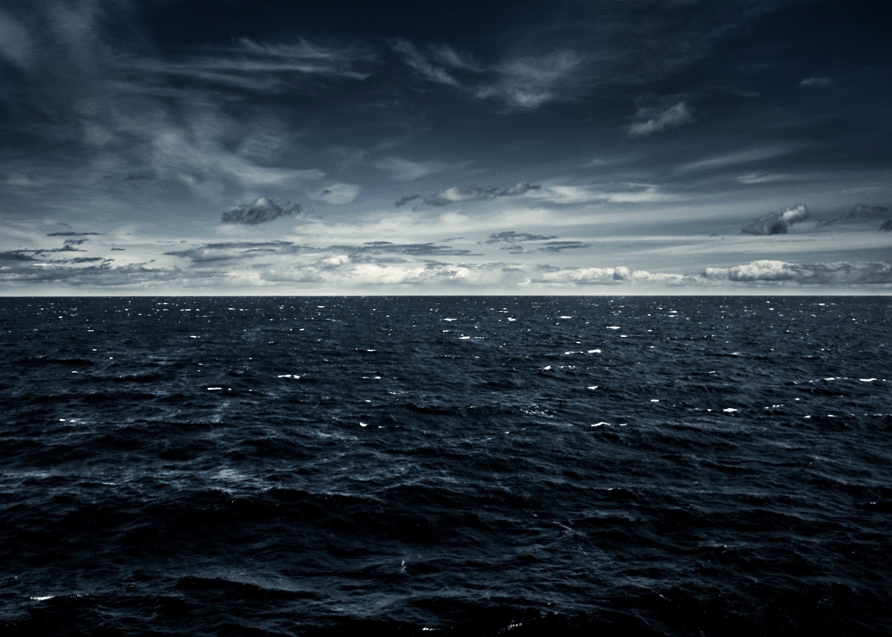

```{r setup, include=FALSE}
knitr::opts_chunk$set(echo = FALSE)
```




This portfolio helped me to see how much our oceans in danger are and what are the problems and the solutions envisaged. 

For plastic pollution there are three solutions we need to focus on.

The first one is to capture floating plastic waste in oceans. One of the most promising solutions for this is, in my view, the "Ocean Cleanup" project. 

They have developed “the System 001/B” to wash oceans. The objective of this system is to use natural forces like sea currents and wind to catch plastic waste by using a huge barrier. Once plastic waste has accumulated against the barrier, a boat extracts them and the plastic is recycled. 

The second solution is to significantly improve the management of plastic, which still has a lot of defaults, in order to reduce the amount of waste thrown into rivers and thus prevent pollution of the ocean.

Thirdly, we have to change our lifestyle in order to slow down plastic production and also avoid single use of plastic as much as possible. 

To fight against ocean acidification, we have to reduce our production of C02 by lowering our activities and finding new energy alternative.

Our oceans are unique and shelter an exceptional fauna and flora. This is there that life started, it is our duty to protect the oceans.
