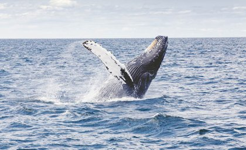

```{r setup, include=FALSE}
knitr::opts_chunk$set(echo = FALSE)
```




## I - SOURCE OF THE ARTICLE WITH PUBLICATION DATE AND WORD COUNT : 


Source of the article: <https://www.uq.edu.au/news/article/2019/11/whales-stop-being-socialites-when-boats-are-about>


Word count: 420


## II - VOCABULARY: See my version of the text with highlighted words 

| Word from the text           | Synonym/definition in English    | French translation            |
| ---------------------------- | -------------------------------- | ----------------------------- |
| Humpback whales              | Large whale with humped body     | Baleines à bosse              |
| Vessels                      | Ships                            | Navires                       |
| Healthy breeding             | Healthy reproduction             | Reproduction saine            |
| Land-based                   | Terrestrial                      | Terrestre                     |
| An offshore hydrophone array | An hydrophone array out at sea   | Un réseau d'hydrophone en mer |
| To give out                  | To abandon                       | Abandonner                    |
| Therefore                    | Thus                             | Donc                          |
| Breeding interaction         | Reproduction interaction         | Interaction de reproduction   |
| Whaling                      | Whale hunting                    | Pêche à la baleine            |
| To the same extent           | To a similar or identical degree | Dans la même mesure           |

## III - ANALYSIS TABLE ABOUT THE STUDY:

|                              |                                                                     |
| ---------------------------- | ------------------------------------------------------------------- |
| __Researchers__                  |   Rebecca A. Dunlop   |
| __Published in?__                |  The Royal Society (11/29/2019)       |
| __General topic?__               |  The effects of vessels noise on the communication and socialization of humpback whales                        |
| __Procedure/what was examined?__ |Comparison of the social interaction of the whales(thanks to   acoustic recordings and  land-based observations) when there are vessels or not|
| __Conclusions/discovery?__       |   In the presence of vessels -> communication and socializing range of whales reduces by a factor of four. __Problem__ : socializing is important for reproduction. __For this moment__ : negligible effect on the population|
| __Remaining questions?__         |/|
