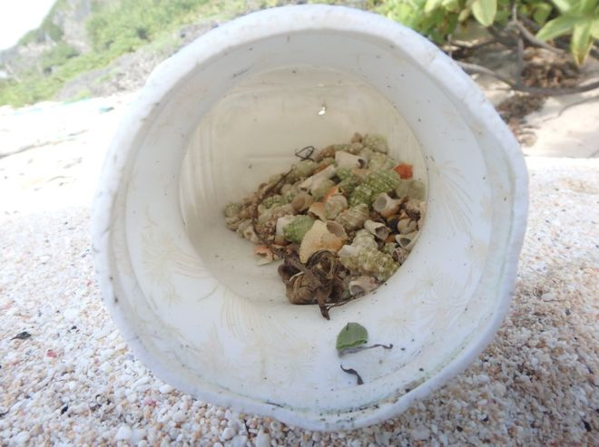

```{r setup, include=FALSE}
knitr::opts_chunk$set(echo = FALSE)
```



## I - SOURCE OF THE ARTICLE WITH PUBLICATION DATE AND WORD COUNT : 


Source of the article: <https://www.bbc.com/news/science-environment-50661449?intlink_from_url=https://www.bbc.com/news/topics/cxj82n9r6dwt/oceans&link_location=live-reporting-story>


Word count: 464


## II - VOCABULARY: See my version of the text with highlighted words 

| Word from the text       | Synonym/definition in English       | French translation |
| ------------------------ | ----------------------------------- | ------------------ |
| A remote island          | An isolated island                  | Une île éloignée   |
| To be under-acknowledged | To be not recognised                | Etre sous-reconnu  |
| A curator                | A conservationist                   | Un conservateur    |
| To entangle              | To knot                             | Emmêler            |
| The daily life           | Every day existence                 | La vie quotidienne |
| To be littered           | To be strewn                        | Être jonché        |
| To crawl                 | To creep                            | Ramper             |
| Upward                   | Direction : up                      | Vers le haut       |
| A shell                  | Mollusc’s exoskeleton               | Une coquille       |
| Very                     | The one already mentioned           | Même               |
| To ensure                | To make sure                        | S'assurer          |
| A lure                   | A bait                              | Un leurre          |
| The latter               | The last mentioned                  | Le dernier         |
| The former               | The old                             | L’ancien           |
| To drawn in              | To be attracted                     | Etre attiré        |
| A seed                   | The product of a fruit for planting | Une graine         |

## III - ANALYSIS TABLE ABOUT THE STUDY:

|                              |                                                                     |
| ---------------------------- | ------------------------------------------------------------------- |
| __Researchers__                  |   Kelsey Vlamis( BBC journalist)  |
| __Published in?__                |  BBC News (12/05/2019)       |
| __General topic?__               |  Hermit crabs killed by plastic pollution on beaches.                        |
| __Procedure/what was examined?__ |Scientists monitor hermit crab populations on the Cocos Islands in the Indian Ocean and Henderson Island in the South Pacific, two remote islands.They counted the number of plastic containers and trapped crabs there. 
| __Conclusions/discovery?__       |  __1.__ Plastic containers on beaches = physical barrier and deadly trap for hermit crabs. __2.__ Crabs go in plastic containers but are unable to get out --> living crabs are attracted by free shells of dead crabs and are blocked in turn. __3.__ In one container 526 hermit crabs have been found. __Alarming decrease__ --> crabs are important in ecosystem : aerate soil + disperse seeds
|
| __Remaining questions?__         |/|
