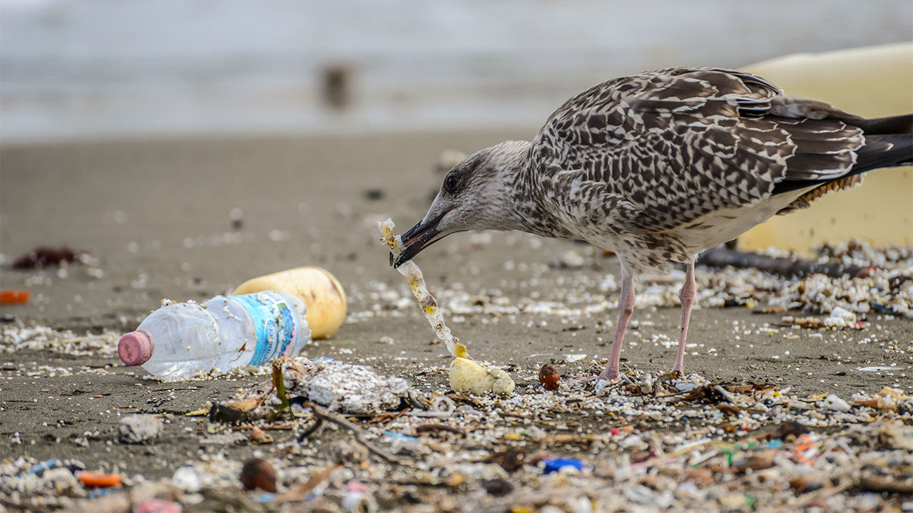

```{r setup, include=FALSE}
knitr::opts_chunk$set(echo = FALSE)
```



## I - SOURCE OF THE ARTICLE WITH PUBLICATION DATE AND WORD COUNT : 


Source of the article: <https://www.newsweek.com/toxic-chemicals-seabirds-eat-plastic-study-1485093>


Word count: 572


## II - VOCABULARY: See my version of the text with highlighted words 

| Word from the text         | Synonym/definition in English                                                                                                          | French translation                               |
| -------------------------- | -------------------------------------------------------------------------------------------------------------------------------------- | ------------------------------------------------ |
| Plastic pellets            | Pastille in plastic                                                                                                                    | Pastilles en plastique                           |
| Streaked shearwater chicks | A species of seabird                                                                                                                   | Poussins d'eau de mer striés ( puffin leucomèle) |
| Fatty tissues              | A kind of body tissue containing stored fat that serves as a source of energy                                                          | Tissus adipeux                                   |
| Pathway                    | A trail                                                                                                                                | Un sentier                                       |
| To emphasize               | To stress                                                                                                                              | Souligner                                        |
| To make its way into       | To get in                                                                                                                              | Pénétrer dans                                    |
| To raise concerns          | To raise issues / Cause concern                                                                                                        | Soulever des préoccupations                      |
| Hazardous chemicals        | Chemical that has properties with the potential to do harm to human or animal health, the environment, or capable of damaging property | Produits chimiques dangereux                     |
| The manufacturing process  | The way that the product is produce                                                                                                    | Le processus de fabrication                      |
| A seagull struggles        | A seagull who wrestles                                                                                                                 | Une mouette qui se débat                         |
| Adverse effects            | Negative effects                                                                                                                       | Effets néfastes                                  |
| Plastic-derived chemicals  | Plastic-based chemicals                                                                                                                | Produits chimiques dérivés du plastique          |

## III - ANALYSIS TABLE ABOUT THE STUDY:

|                              |                                                                     |
| ---------------------------- | ------------------------------------------------------------------- |
| __Researchers__                  |   Aristos Georgiou (a science writer and news reporter for Newsweek)  |
| __Published in?__                |  Newsweek (01/31/2020)       |
| __General topic?__               |  Impact of plastic and plastic-derived chemicals on seabirds’ bodies.                        |
| __Procedure/what was examined?__ | __1.__ Scientist fed young seabirds with plastic pellets in Japan. __2.__ Scientist monitor the evolution of the number of plastics in our ocean. __3.__ Scientist survey six seabird’s species living in Hawaii.
 | __Conclusions/discovery?__       |  __1.__ Birds accumulate chemical additives in their liver and fatty tissues 120,000 times more than it should be in normal conditions. __2.__ There is more and more plastic in marine wildlife, every year eight tons go in oceans __-->__ The number of marine animals that ingest plastic will also raise up especially seabirds. __3.__ By ingesting plastic birds are intoxicated by dangerous chemicals. __Moreover__: Plastic can hurt the digestive trac and be mortal for the animal. Plastic also contains hazardous chemicals dangerous and accumulate in the tissues of the animal.|
| __Remaining questions?__         |What the health impacts are on marine animals?|

