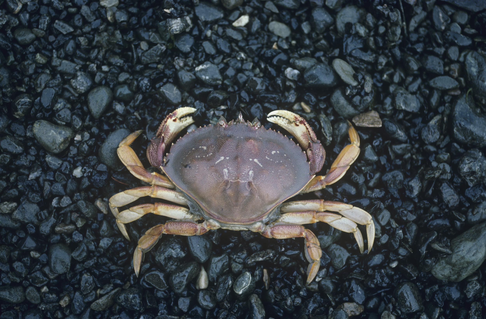

```{r setup, include=FALSE}
knitr::opts_chunk$set(echo = TRUE)
```




## I - SOURCE OF THE ARTICLE WITH PUBLICATION DATE AND WORD COUNT : 


Source of the article: <https://edition.cnn.com/2020/01/27/us/pacific-ocean-acidification-crabs-dissolving-shells-scn-trnd/index.html>


Word count: 583


## II - VOCABULARY: See my version of the text with highlighted words 

| Word from the text | Synonym/definition in English | French translation                          |
| ------------------ | ----------------------------- | ------------------------------------------- |
| Coastal waters     | Territorial waters            | Les eaux côtières                           |
| To forebode        | To predict                    | Présager                                    |
| Algae blooms       | Algae spreading everywhere    | Des proliférations d'algues                 |
| To rely on         | To depend on                  | Se reposer sur                              |
| Clams              | Molluscs eaten as sea food    | Des palourdes                               |
| To corrode         | To oxidize                    | Corroder                                    |
| To odd             | To disturb                    | Perturber, faire évoluer de manière anormal |
| To deter           | To harm                       | Nuire                                       |
| Buoyancy           | Flotation                     | La flottabilité                             |
| Mess               | Dirty condition               | Le désordre                                 |

## III - ANALYSIS TABLE ABOUT THE STUDY:


|                              |                                                                     |
| ---------------------------- | ------------------------------------------------------------------- |
| __Researchers__                  |   Scottie Andrew (CNN journalist)  |
| __Published in?__                |  CNN (01/27/2020)       |
| __General topic?__               |  The impact of ocean acidification on Dungeness crabs’ shells.                        |
| __Procedure/what was examined?__ | The National Oceanic and Atmospheric Administration (NOAA) studies ocean acidification and how changing pH levels are impacting coast and the marine life like crabs.
 | __Conclusions/discovery?__       |  The Pacific Ocean is becoming more acidic because it absorbs more carbon dioxide from the atmosphere than before. __Impact on the crabs:__ **1.** Acidity dissolves some part of Dungeness crabs’ shells and damage their mechanoreceptors **-->** without sensory organs it becomes difficult for them to swim and search food. **2.** Carbonate ions used by crabs to build their shells become rarer **-->** their shells become more brittle. **-->** they become less immune to predators. **3.** Larvae with their shell partly dissolved are smaller than the average **-->** problems of maturation **-->** less chance to survive.        **Solution:** Reducing the amount of CO2 in the atmosphere in order to reduce the CO2 absorbed by the ocean.|
| __Remaining questions?__         |The acidity of Ocean has an impact on larvae but we still have to study the impact on the adults.|
